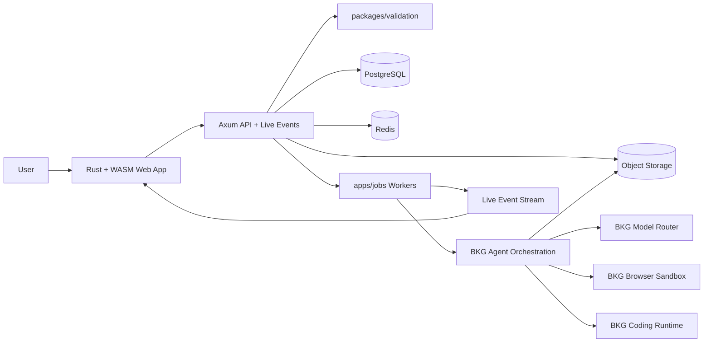

# BKG

**Blueprint. Kinetic. Genesis.**

BKG is an AI-powered game-development platform that turns a game idea into a playable, tested, exportable, and launch-ready retro pixel game. BKG is the production platform; the games created through BKG are the product artifacts.

## Release 00 Position

Release 00 establishes repository conventions, documentation structure, security expectations, and the Rust + WASM platform contract. Implementation detail is introduced in Release 01 and later with code, tests, and release evidence.

## Quick Start

### Prerequisites

- Rust 1.85+ through rustup
- Docker and Docker Compose v2+
- PostgreSQL 16+ or the local Compose stack
- Redis 7+ or the local Compose stack

### Setup Flow

```bash
git status
make setup
make build
make test
make lint
```

The commands above are the standard developer entry points for the BKG repository. Release 00 defines the expected workflow before the full Rust workspace is populated.

## Architecture



## Monorepo Layout

| Path | Purpose |
|------|---------|
| `bkg/apps/web` | Rust + WASM web application and browser UI. |
| `bkg/apps/jobs` | Tokio workers and background job orchestration. |
| `bkg/packages/*` | Shared Rust crates for validation, contracts, database, auth, AI adapters, agents, live events, voice, game engines, observability, config, and testing. |
| `bkg/docs/architecture` | Architecture conventions and structural references. |
| `bkg/docs/release-evidence` | Release gate evidence directories. |
| `bkg/migrations` | Database migrations. |
| `bkg/scripts` | Build, setup, and utility scripts. |
| `bkg/tests` | Integration and end-to-end tests. |

## Documentation Map

- [Architecture Overview](docs/architecture/overview.md)
- [Technology Stack Matrix](docs/architecture/stack.md)
- [External Component Conventions](docs/architecture/external-components.md)
- [Security Policy](SECURITY.md)
- [Contributing Guide](CONTRIBUTING.md)
- [Production Master Prompt](PLAN.md)

## Security Baseline

Secrets never belong in source control, browser bundles, logs, tickets, or generated documentation. Use `.env` only for local development placeholders and keep production credentials in a dedicated secret store.

See [SECURITY.md](SECURITY.md) for secret handling, vulnerability disclosure, dependency scanning, and incident response rules.

## License

Proprietary — Forgefabrik internal use.
