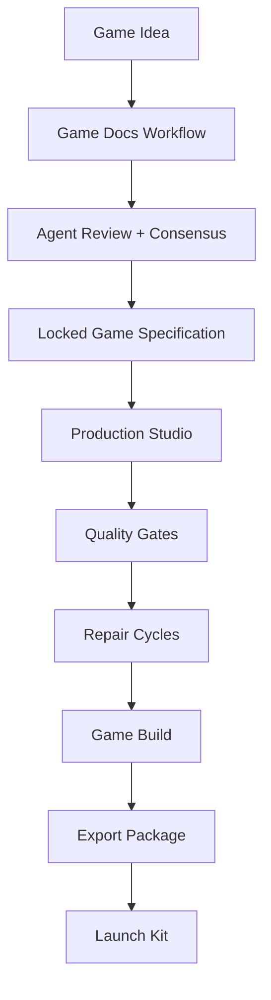

# BKG Architecture Overview

## Platform Concept

BKG is an AI-powered game-development platform. A user enters a game idea, and BKG coordinates specialized agents through planning, production, quality gates, export, and launch preparation.

BKG is not a game. BKG is the studio system that produces games.

The Release 00 architecture defines the structural contract for the platform:

1. Rust services own the backend, workers, adapters, and domain logic.
2. Rust + WASM owns browser-facing surfaces.
3. PostgreSQL owns durable relational state.
4. Redis owns queues, cache, and live coordination state.
5. Object storage owns generated assets, builds, exports, and launch artifacts.
6. BKG adapters own external component boundaries.

The detailed production rules come from [PLAN.md](../PLAN.md), especially the Rust + WASM stack, external component boundaries, and release evidence requirements.

## Core Flow

No production pipeline may start before the Game Specification is complete, validated, approved, and locked.

## Rust + WASM Stack

BKG uses Rust as the production language for backend services, workers, shared crates, adapters, and domain logic. Browser-facing application code is implemented as Rust + WASM.

Release 00 conventions:

- Rust 2024 edition for all crates.
- Cargo workspace for shared dependencies and package boundaries.
- Axum or an equivalent Rust web framework for HTTP and WebSocket services.
- Tokio for async runtime behavior.
- Serde for serialization boundaries.
- SQLx or SeaORM for database access, with parameterized queries.
- Leptos, Dioxus, Yew, or an equivalent Rust + WASM UI framework for browser surfaces.
- WebSockets or SSE for live event delivery.

## Monorepo Layout

| Path | Responsibility |
|------|----------------|
| `bkg/apps/web` | Web application, browser UI, authentication flows, studio surfaces, live event clients, preview, export, and launch pages. |
| `bkg/apps/jobs` | Background workers, queues, retry handling, dead-letter processing, and long-running production jobs. |
| `bkg/packages/contracts` | Shared domain contracts and cross-crate interfaces. |
| `bkg/packages/validation` | Input validation, schema rules, and request boundaries. |
| `bkg/packages/database` | Database access, migrations integration, and persistence helpers. |
| `bkg/packages/auth` | Identity, sessions, roles, and authorization primitives. |
| `bkg/packages/ai` | Provider-neutral AI adapters and model routing boundaries. |
| `bkg/packages/agents` | Agent orchestration, consensus, review, and task coordination. |
| `bkg/packages/live-events` | Event streams, WebSocket/SSE delivery, and production status updates. |
| `bkg/packages/voice` | TTS, STT, and voice discussion workflows. |
| `bkg/packages/game-docs` | Game Specification document lifecycle. |
| `bkg/packages/game-engine` | Runtime and game execution contracts. |
| `bkg/packages/pixel-engine` | Pixel production and asset generation contracts. |
| `bkg/packages/animation-engine` | Sprite and animation pipeline contracts. |
| `bkg/packages/level-engine` | Level construction and validation contracts. |
| `bkg/packages/audio-engine` | Music and sound effects pipeline contracts. |
| `bkg/packages/observability` | Tracing, metrics, logs, and audit event integration. |
| `bkg/packages/config` | Environment and runtime configuration. |
| `bkg/packages/testing` | Shared test utilities and integration helpers. |
| `docs/architecture` | Architecture documents and conventions. |
| `docs/release-evidence` | Release gate evidence. |
| `migrations` | SQL migrations. |
| `scripts` | Repository and release utility scripts. |
| `tests` | Integration and end-to-end tests. |

## Architectural Conventions

### Adapter-First Integration

Business logic must not depend directly on external component internals. Every external system is represented by an internal BKG adapter with normalized inputs, outputs, errors, timeouts, retries, health checks, audit logs, and redacted telemetry.

### Release-Gated Detail

Release 00 defines the platform shape. Release 01 and later must replace structural placeholders with implementation-backed detail:

- code paths;
- tests;
- migrations;
- configuration;
- deployment behavior;
- release evidence.

### Platform, Not Game

All architecture, runtime, build, export, and preview concepts refer to generated games. BKG remains the production platform and studio operating system.

## Related Documents

- [Technology Stack Matrix](stack.md)
- [External Component Conventions](external-components.md)
- [Security Policy](../SECURITY.md)
- [Contributing Guide](../CONTRIBUTING.md)
- [Production Master Prompt](../PLAN.md)
